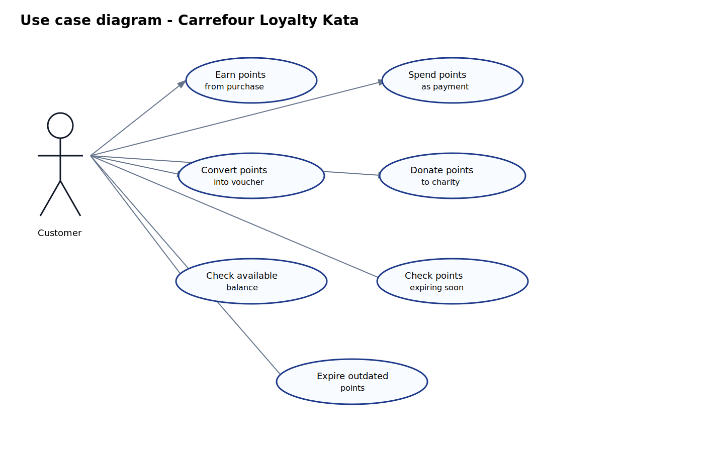

# Carrefour Loyalty Kata

Spring Boot kata implementing a minimal loyalty points system with in-memory persistence.

## Stack

- Java 25
- Spring Boot
- Maven

## Functional scope

- Earn points from purchase amount in cents
- Spend points with FIFO bucket consumption
- Voucher conversion with fixed points cost
- Donation using a custom points amount
- Balance retrieval
- Expiring-soon points retrieval
- Explicit expiration execution

## Main assumptions

- `100` cents spent gives `1` point
- One earn action creates one point bucket
- Bucket validity is `365` days
- `expiring-soon` means expiration within `30` days
- Voucher spend cost is fixed to `100` points
- Accounts are created automatically on first earn
- Repository is in-memory only

## API endpoints

- `POST /customers/{customerId}/points/earn`
- `POST /customers/{customerId}/points/spend`
- `POST /customers/{customerId}/points/voucher`
- `POST /customers/{customerId}/points/donate`
- `GET /customers/{customerId}/points/balance`
- `GET /customers/{customerId}/points/expiring-soon`
- `POST /customers/{customerId}/points/expire`

## Run

```bash
mvn spring-boot:run
```

## Test

```bash
mvn test
```

## Useful diagrams




