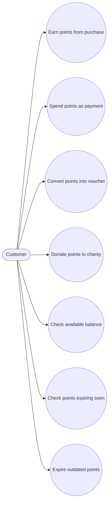
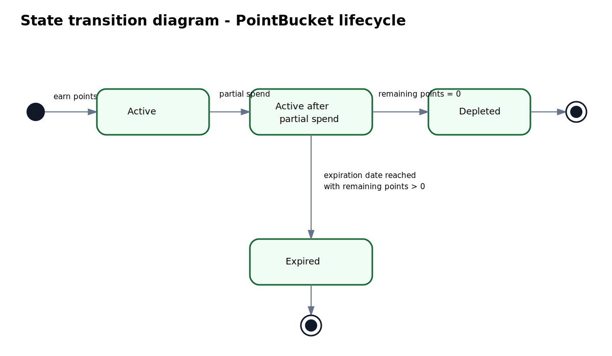
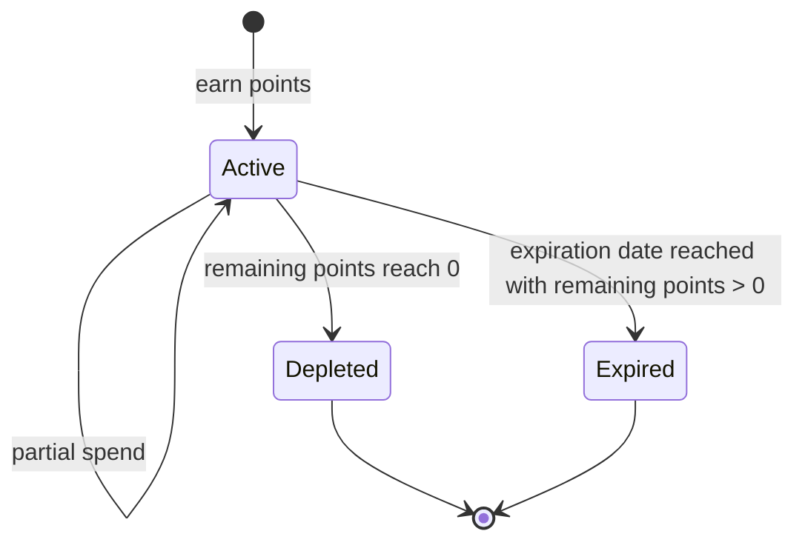
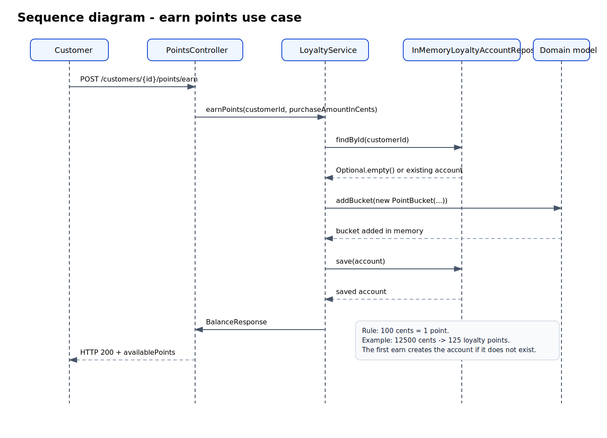
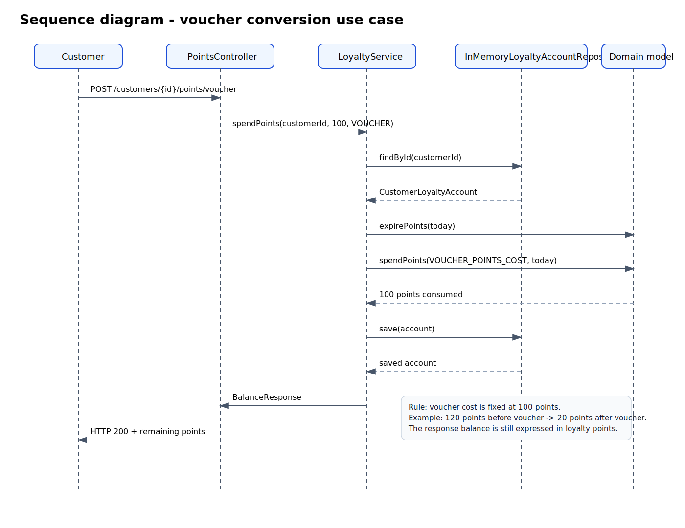
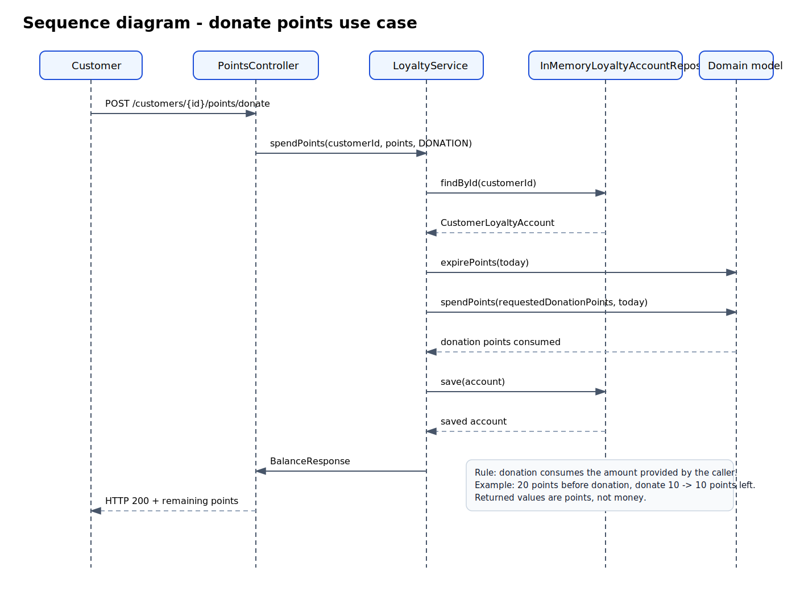
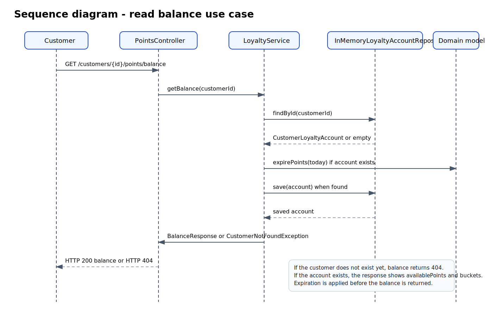
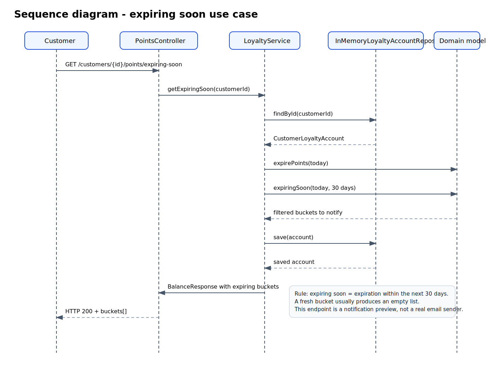
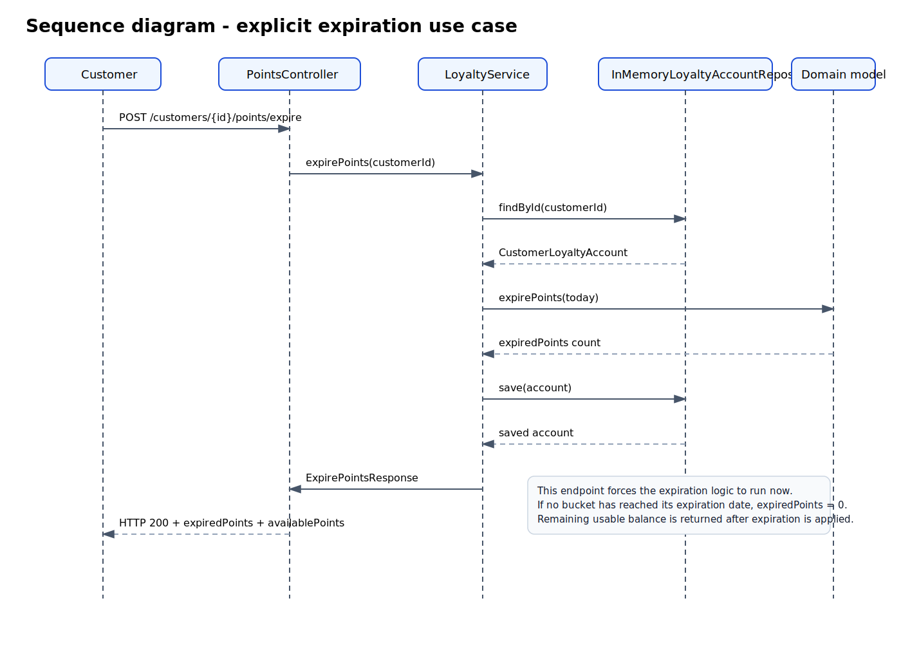
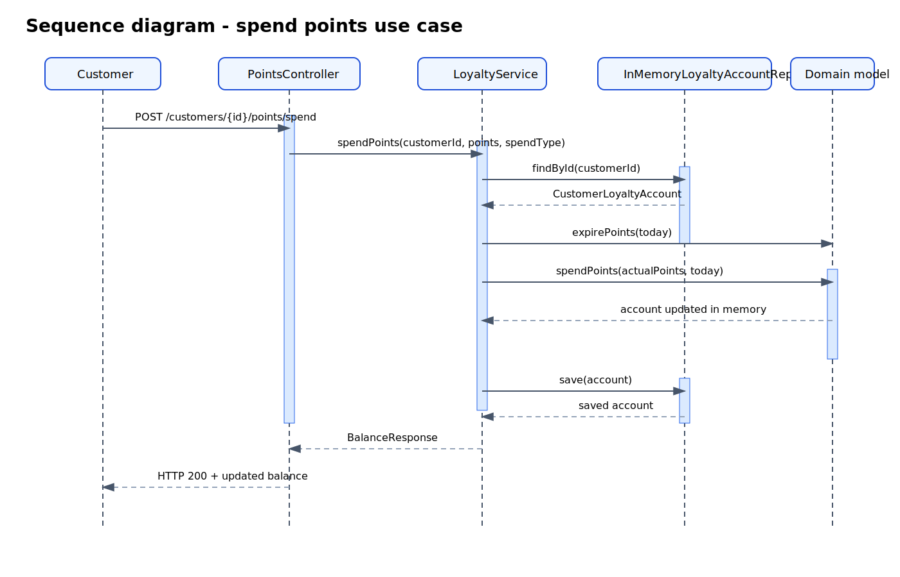

# Carrefour Loyalty Kata - Minimal Spring Boot Solution

## What is intentionally simplified to stay realistic in 1h45

Before writing code, the implementation deliberately keeps the scope small:

- **in-memory repositories only**: no JPA, no H2, no migrations,
- **no customer management workflow**: an account is created automatically on first earn,
- **no real notification system**: `expiring-soon` simply returns the buckets that should trigger a notification,
- **no transaction history**: not essential for the MVP,
- **voucher and donation are very small use cases** built on the same spending logic,
- **few focused tests** on the core business rules only.

This keeps the kata small enough to be believable for a single candidate in a technical test while still showing real business logic.

## Architecture

The project uses a simple **layered architecture**:

- `controller`: REST endpoints,
- `service`: use-case orchestration,
- `repository`: in-memory persistence,
- `model`: business state and core rules,
- `dto`: API payloads,
- `exception`: API error handling,
- `config`: technical configuration.

## Where the domain is

The domain is mainly in the `model` package:

- `CustomerLoyaltyAccount` carries account-level rules,
- `PointBucket` carries bucket-level rules,
- `SpendType` expresses allowed spending usages.

The service layer does **application orchestration**:

- convert euros into points,
- trigger expiration before spending,
- delegate consumption to the domain model,
- expose simple endpoints.

This is coherent for a short kata because the core rules stay in the model while the service keeps the workflow readable.

## Business assumptions

- `1 euro spent = 1 point earned`,
- request amounts are expressed in **euro cents**,
- one earn action creates one `PointBucket`,
- a bucket expires after **365 days**, inclusive on the expiration date,
- consumption uses FIFO: the earliest earned bucket is consumed first,
- `voucher` consumes a fixed **100 points**,
- `donation` consumes a caller-provided amount,
- `expiring-soon` means **expiration within the next 30 days**.

## Endpoints

- `POST /customers/{customerId}/points/earn`
- `POST /customers/{customerId}/points/spend`
- `POST /customers/{customerId}/points/voucher`
- `POST /customers/{customerId}/points/donate`
- `GET /customers/{customerId}/points/balance`
- `GET /customers/{customerId}/points/expiring-soon`
- `POST /customers/{customerId}/points/expire`

## Project tree

```text
.
├── .gitignore
├── ALL_PROJECT_FILES.txt
├── README.md
├── pom.xml
├── src
│   ├── main
│   │   ├── java
│   │   │   └── com
│   │   │       └── carrefour
│   │   │           └── loyalty
│   │   │               ├── LoyaltyApplication.java
│   │   │               ├── config
│   │   │               │   └── ClockConfig.java
│   │   │               ├── controller
│   │   │               │   └── PointsController.java
│   │   │               ├── dto
│   │   │               │   ├── BalanceResponse.java
│   │   │               │   ├── DonatePointsRequest.java
│   │   │               │   ├── EarnPointsRequest.java
│   │   │               │   ├── ExpirePointsResponse.java
│   │   │               │   ├── PointBucketResponse.java
│   │   │               │   └── SpendPointsRequest.java
│   │   │               ├── exception
│   │   │               │   ├── ApiError.java
│   │   │               │   ├── CustomerNotFoundException.java
│   │   │               │   ├── GlobalExceptionHandler.java
│   │   │               │   └── InsufficientPointsException.java
│   │   │               ├── model
│   │   │               │   ├── CustomerLoyaltyAccount.java
│   │   │               │   ├── PointBucket.java
│   │   │               │   └── SpendType.java
│   │   │               ├── repository
│   │   │               │   ├── InMemoryLoyaltyAccountRepository.java
│   │   │               │   └── LoyaltyAccountRepository.java
│   │   │               └── service
│   │   │                   └── LoyaltyService.java
│   │   └── resources
│   │       └── application.properties
│   └── test
│       └── java
│           └── com
│               └── carrefour
│                   └── loyalty
│                       ├── controller
│                       │   └── PointsControllerTest.java
│                       └── service
│                           └── LoyaltyServiceTest.java
└── target
    └── ... generated by Maven during build and ignored by Git
```

## Detailed use-case explanation

A detailed functional walkthrough of every use case, unit, and endpoint result is available here:

- [`docs/DETAILED_USE_CASES.md`](docs/DETAILED_USE_CASES.md)

## UML diagrams

### Use case diagram




### State transition diagram for one `PointBucket`





### Sequence diagrams for all seven use cases

#### 1. Earn points


#### 2. Spend points as payment


#### 3. Convert points into a voucher


#### 4. Donate points


#### 5. Read balance


#### 6. List points expiring soon


#### 7. Apply explicit expiration


The original single spend-flow image is also kept here:



Direct image URLs:
- [`docs/sequence-earn-use-case.svg`](docs/sequence-earn-use-case.svg)
- [`docs/sequence-spend-use-case.svg`](docs/sequence-spend-use-case.svg)
- [`docs/sequence-voucher-use-case.svg`](docs/sequence-voucher-use-case.svg)
- [`docs/sequence-donate-use-case.svg`](docs/sequence-donate-use-case.svg)
- [`docs/sequence-balance-use-case.svg`](docs/sequence-balance-use-case.svg)
- [`docs/sequence-expiring-soon-use-case.svg`](docs/sequence-expiring-soon-use-case.svg)
- [`docs/sequence-expire-use-case.svg`](docs/sequence-expire-use-case.svg)
- [`docs/sequence-diagram.svg`](docs/sequence-diagram.svg)

## Run the application

```bash
mvn spring-boot:run
```

## Run the tests

```bash
mvn test
```

## Curl examples

### Earn points

```bash
curl -X POST http://localhost:8080/customers/cust-1/points/earn \
  -H 'Content-Type: application/json' \
  -d '{"purchaseAmountInCents": 12500}'
```

### Spend points as payment

```bash
curl -X POST http://localhost:8080/customers/cust-1/points/spend \
  -H 'Content-Type: application/json' \
  -d '{"points": 40, "spendType": "PAYMENT"}'
```

### Convert points into a voucher

```bash
curl -X POST http://localhost:8080/customers/cust-1/points/voucher
```

### Donate points

```bash
curl -X POST http://localhost:8080/customers/cust-1/points/donate \
  -H 'Content-Type: application/json' \
  -d '{"points": 25}'
```

### Read balance

```bash
curl http://localhost:8080/customers/cust-1/points/balance
```

### List buckets expiring soon

```bash
curl http://localhost:8080/customers/cust-1/points/expiring-soon
```

### Expire buckets now

```bash
curl -X POST http://localhost:8080/customers/cust-1/points/expire
```

## Voluntary limits

The following items are intentionally out of scope to stay inside a realistic kata budget:

- no database,
- no scheduled jobs,
- no email/SMS notification,
- no authentication,
- no voucher document generation,
- no charity catalog,
- no detailed transaction history.
